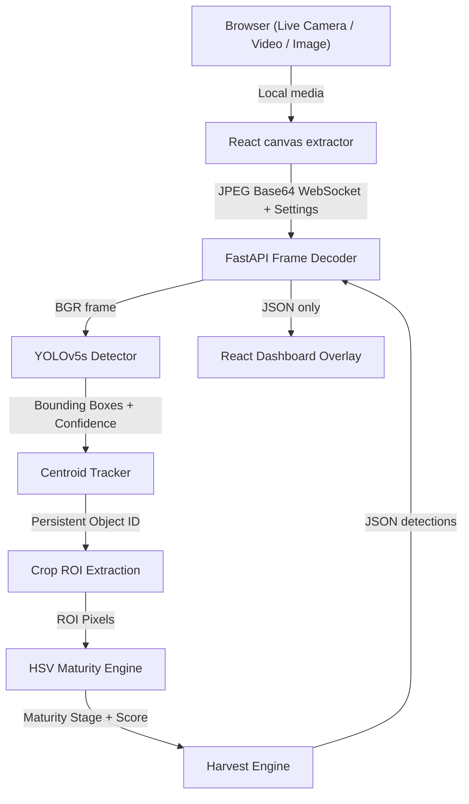
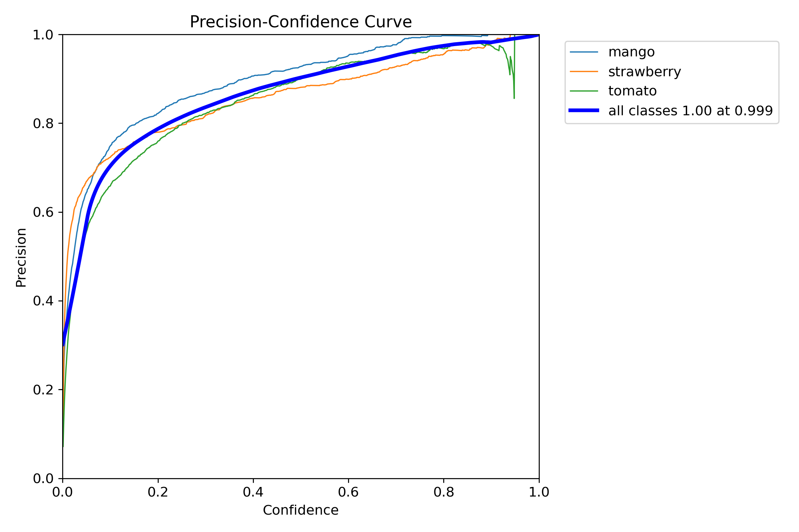
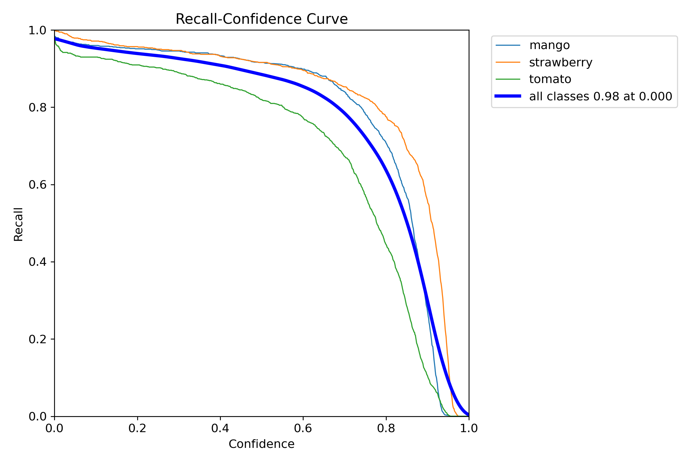
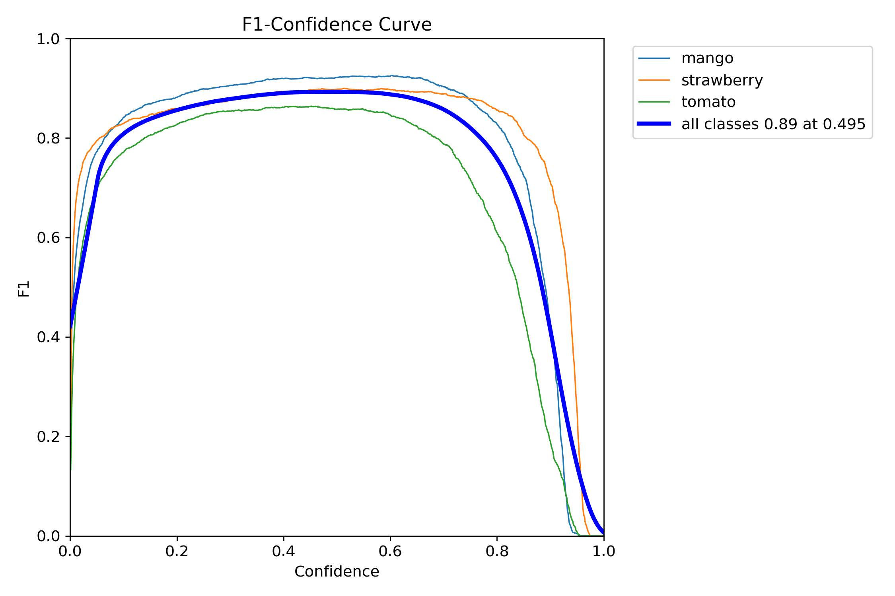
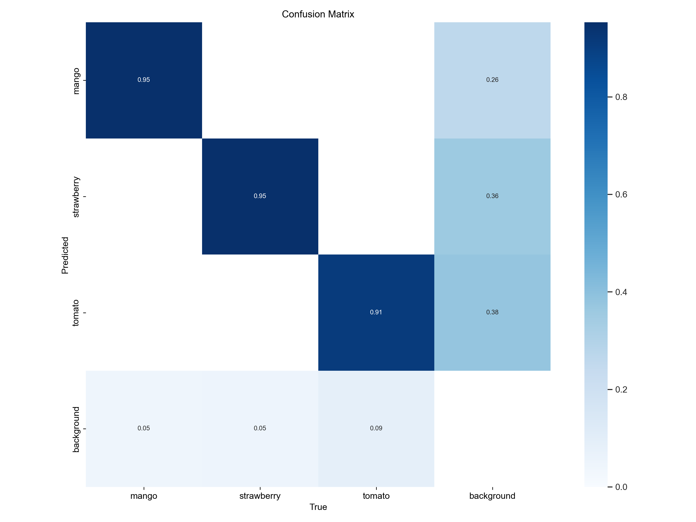
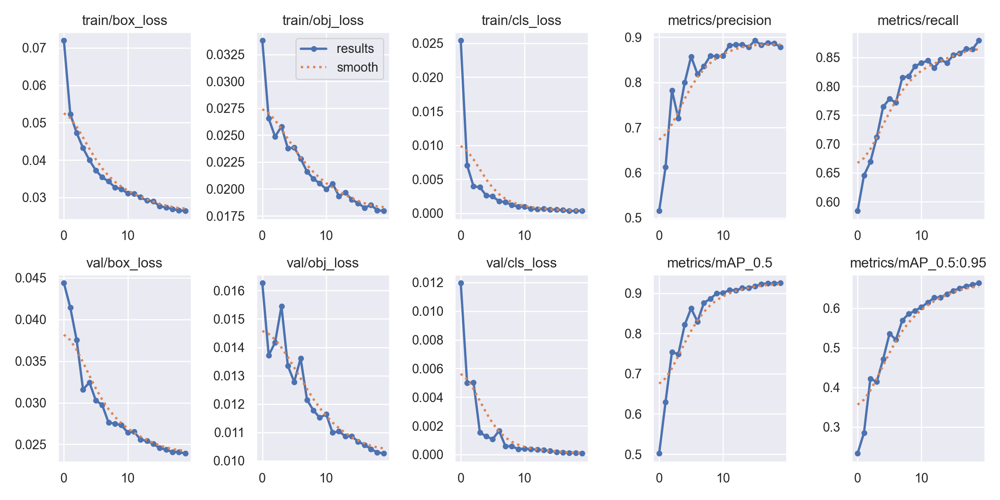

# AI Crop Maturity Detection System

A real-time computer vision system for detecting agricultural crops, tracking individual fruits, estimating maturity, and predicting harvest readiness from a **browser webcam**.

Developed as an internal technical initiative at **Evolvian Softwares**, this project currently supports:

- 🍅 Tomatoes
- 🥭 Mangoes
- 🍓 Strawberries

The browser captures the user's webcam and sends JPEG frames to FastAPI over WebSocket. Inference still runs locally (or later in a cloud container) with the trained **YOLOv5s** model. The backend never opens `cv2.VideoCapture(0)` on the production WebSocket path.

---

## 📌 Project Overview

The **AI Crop Maturity Detection System** is an end-to-end computer vision pipeline designed to analyze crops directly from a live camera stream.

The system performs:

1. Browser webcam capture (`getUserMedia`)
2. JPEG frame transport over WebSocket
3. Real-time crop detection using the trained YOLOv5s weights
4. Persistent object identification using a custom centroid tracker
5. Region of Interest (ROI) extraction
6. HSV-based maturity analysis
7. Crop-specific maturity stage classification
8. Rule-based harvest readiness prediction
9. Estimated harvest-time calculation
10. Overlay of JSON detections on the live local video

The current implementation is a **cloud-ready local MVP**: the camera lives in the browser, and the backend only receives frames and returns analysis JSON.

---

# 🏗️ System Architecture



---

# 🔄 End-to-End Pipeline

```text
Browser (Live Camera / Video / Image)
   │
   ▼
React canvas (variable inference resolution)
   │
   ├── JPEG encode (quality ~0.6)
   └── Send payload (Image + Settings) via WebSocket
   │
   ▼
FastAPI WebSocket decoder
   │
   ▼
YOLOv5 Detector
   │
   ├── Crop Class
   ├── Confidence
   └── Bounding Box
   │
   ▼
Centroid Tracker
   │
   └── Persistent Object ID
   │
   ▼
ROI Extraction
   │
   └── Crop detected region
   │
   ▼
HSV Maturity Engine
   │
   ├── HSV Conversion
   ├── Color Masking
   ├── Color Distribution
   └── Maturity Stage / Score
   │
   ▼
Harvest Engine
   │
   ├── Crop Configuration
   ├── Maturity Stage
   └── Harvest Rules
   │
   ▼
Readiness + Estimated Harvest Time
   │
   ▼
FastAPI WebSocket
   │
   ▼
React / Vite Dashboard
```

---

# 🎯 Project Objectives

The primary objectives of the project are:

- Detect agricultural crops in real-time.
- Identify individual crop objects in a video stream.
- Maintain object identity across consecutive frames.
- Extract individual crop regions for detailed analysis.
- Estimate crop maturity using computer vision.
- Calculate maturity scores.
- Determine harvest readiness.
- Estimate approximate harvest time.
- Display real-time analysis through a web dashboard.
- Generate crop-specific analysis information.
- Keep all inference and processing local.

---

# 🌱 Supported Crops

The current MVP is designed for:

## 🍅 Tomato

Tomato maturity is primarily estimated through visible color progression.

Example maturity progression:

```text
Green
   ↓
Breaker
   ↓
Turning
   ↓
Light Red
   ↓
Red
```

## 🥭 Mango

Mango maturity is handled through crop-specific configuration and visual maturity rules.

## 🍓 Strawberry

Strawberry maturity is estimated primarily through visible color progression and crop-specific maturity thresholds.

Each crop can have its own maturity stages and configuration.

---

# 🔍 Core Components

## 1. Browser Media Pipeline

The user's browser handles media input. The backend never accesses a physical camera on the production WebSocket path.

### Frontend responsibilities

- Provide input modes for Live Camera (`getUserMedia`), Video upload, and Image upload
- Display the live stream or media in a `<video>` or `` element
- Capture JPEG frames from a reusable canvas (with configurable inference resolution)
- Send one frame at a time over WebSocket along with user settings (Confidence, Resolution, CLAHE)
- Overlay detections on the local media

### Backend responsibilities

- Decode Base64 JPEG frames into OpenCV BGR images
- Apply optional preprocessing (like CLAHE) based on frontend settings
- Run the existing YOLOv5s / tracker / ROI / maturity / harvest pipeline using dynamic configuration
- Return JSON analysis only (no processed video frames)

`cv/camera.py` remains in the repository for optional local OpenCV experiments. The live dashboard path does not use `cv2.VideoCapture(0)`.

---

## 2. YOLOv5 Object Detection

YOLOv5 is responsible for detecting crops in each video frame.

The detector provides:

- Crop class
- Bounding box coordinates
- Confidence score

Conceptually:

```text
Input Frame
     ↓
YOLOv5
     ↓
Crop Detection
     ↓
Bounding Box + Confidence
```

The system supports dynamic configuration of the **confidence threshold** and **inference resolution** directly from the frontend dashboard. The default confidence is set to 40% (`0.40`), but users can adjust it in real-time. Optional CLAHE preprocessing can also be enabled before the frame is passed to the detector.

Weights are loaded from a project-root path:

```text
models/detection/yolov5s_trained.pt
```

YOLOv5 architecture code is loaded with `torch.hub.load("ultralytics/yolov5", "custom", ...)`. The hub cache is stored in `.torch_hub/` at the project root. For offline/Docker use later, clone the YOLOv5 repo to `third_party/yolov5` and the detector will load that local copy instead of downloading at runtime. The trained `.pt` file is never replaced.

Example detection result:

```json
{
    "class": "tomato",
    "confidence": 0.91,
    "bbox": [120, 80, 300, 280]
}
```

---

# 🆔 3. Centroid Tracker

A custom Euclidean-distance centroid tracker is used to maintain persistent object IDs between frames.

Without tracking:

```text
Frame 1 → Tomato
Frame 2 → Tomato
Frame 3 → Tomato
```

The system may treat these detections as different objects.

With tracking:

```text
Frame 1 → Tomato #01
Frame 2 → Tomato #01
Frame 3 → Tomato #01
```

The tracker:

1. Calculates the centroid of each detected object.
2. Compares object locations across consecutive frames.
3. Matches detections based on Euclidean distance.
4. Assigns persistent IDs to objects.

This ensures that metadata remains associated with the correct physical crop as it moves through the camera frame.

---

# ✂️ 4. ROI Extraction

Once YOLO provides a bounding box, the corresponding fruit region is cropped from the original frame.

```text
Full Camera Frame
        ↓
YOLO Bounding Box
        ↓
Crop Bounding Box
        ↓
ROI
```

The ROI is the actual image region containing the detected crop.

Example:

```text
Full Frame
       ↓
┌──────────────────────────┐
│                          │
│      ┌───────────┐       │
│      │  TOMATO   │       │
│      └───────────┘       │
│                          │
└──────────────────────────┘
              ↓
       Tomato ROI
```

The maturity engine receives this ROI rather than the complete camera image.

---

# 🎨 5. HSV Maturity Engine

The current MVP uses a **Level 1 Computer Vision approach** for maturity estimation.

The maturity engine receives the crop ROI and performs HSV-based color analysis.

```text
Crop ROI
   ↓
HSV Conversion
   ↓
Color Masking
   ↓
Color Distribution
   ↓
Maturity Stage
   ↓
Maturity Score
```

The engine analyzes visual characteristics such as:

- Hue
- Saturation
- Brightness / Value
- Percentage of pixels in maturity-related color ranges
- Crop-specific color distributions

For example, a tomato can be analyzed using the proportions of green, yellow, orange and red regions.

Conceptually:

```text
Tomato ROI
    ↓
HSV
    ↓
Color Masks
    ↓
Green / Yellow / Orange / Red Distribution
    ↓
Maturity Stage
```

---

# 📊 6. Maturity Score

The maturity engine produces both:

- Maturity stage
- Maturity score

Example:

```json
{
    "stage": "light_red",
    "score": 84
}
```

The score represents the maturity position according to the project's crop-specific maturity scale.

---

# 🚜 7. Harvest Engine

The Harvest Engine converts maturity information into a harvest-readiness result.

```text
Maturity Stage
       +
Maturity Score
       +
Crop Configuration
       ↓
Harvest Engine
       ↓
Harvest Readiness
       +
Estimated Harvest Time
```

Example:

```json
{
    "readiness": "high",
    "estimated_harvest": "2-3 days"
}
```

The current implementation uses a **rule-based approach** rather than a learned harvest-time prediction model.

---

# ⚙️ 8. Crop Knowledge Base

Crop-specific information is maintained in:

```text
config/crops.yaml
```

The configuration can contain:

- Maturity stages
- Color thresholds
- Readiness rules
- Harvest timing rules
- Temperature/storage information
- Crop-specific parameters

Conceptual example:

```yaml
tomato:
  maturity:
    stages:
      - green
      - breaker
      - turning
      - light_red
      - red

  harvest:
    ...

strawberry:
  maturity:
    stages:
      - unripe
      - semi_ripe
      - ripe

  harvest:
    ...

mango:
  maturity:
    stages:
      - early
      - premature
      - mature
      - ripe

  harvest:
    ...
```

---

# 🧠 9. Analysis Engine

The different outputs are combined into a unified analysis result.

Example:

```text
YOLO
 ↓
Crop = Tomato
Confidence = 94%
 ↓
Tracker
 ↓
Object ID = 17
 ↓
ROI
 ↓
Maturity Engine
 ↓
Stage = Light Red
Score = 84%
 ↓
Harvest Engine
 ↓
Readiness = High
ETA = 2–3 days
```

---

# 📦 Standard Analysis Result

The system can represent the final analysis using a structured JSON payload such as:

```json
{
    "object_id": 17,
    "crop": "tomato",
    "detection_confidence": 0.94,
    "bbox": [120, 80, 300, 280],
    "maturity": {
        "stage": "light_red",
        "score": 84
    },
    "harvest": {
        "readiness": "high",
        "estimated_time": "2-3 days"
    },
    "temperature": "18-21 C"
}
```

This structured result is passed through the backend and consumed by the frontend.

---

# 🔌 10. FastAPI Backend

FastAPI provides the local backend communication layer.

The backend can run on localhost for development. The same WebSocket contract (`/ws/detect`) is intended for a later cloud container using `VITE_WS_URL` / `wss://`.

Example local backend:

```text
http://localhost:8080
```

The backend separates:

```text
Computer Vision / AI
        ↕
     FastAPI
        ↕
Frontend / Dashboard
```

Its responsibilities include:

- WebSocket communication
- Real-time JSON payload delivery
- Data synchronization
- Backend routing
- Communication between the AI pipeline and frontend

---

# ⚡ 11. WebSocket Communication

The live system uses asynchronous WebSocket communication.

Conceptually:

```text
Browser JPEG frame + Settings
     ↓
WebSocket JSON { "image": "data:image/jpeg;base64,...", "settings": {...} }
     ↓
FastAPI decode & config apply
     ↓
AI Pipeline (YOLOv5s with dynamic config)
     ↓
JSON { "detections": [...] }
     ↓
React overlay on local media
```

The backend does **not** send processed video frames back. Frames are processed with a request/response strategy to avoid a backlog: send one frame, wait for the result, then capture the newest frame.

Set the frontend WebSocket URL with `VITE_WS_URL`. Local fallback:

```text
ws://127.0.0.1:8080/ws/detect
```

---

# 🖥️ 12. React / Vite Dashboard

The frontend provides the user interface.

The dashboard can display:

- Live camera feed, Video playback, or Static Image viewing
- Light/Dark mode toggling and collapsible sidebar
- Interactive settings: Input Mode, Confidence Threshold, CLAHE Preprocessing, Frame Skip, Inference Resolution
- Detection bounding boxes
- Crop names
- Persistent object IDs
- Detection confidence
- Maturity stage
- Maturity score
- Harvest readiness
- Estimated harvest time
- Crop-specific information (e.g. optimal storage temperature)

Example:

```text
┌────────────────────────────────────────────┐
│          AI CROP MATURITY SYSTEM           │
├────────────────────────────────────────────┤
│                                            │
│              LIVE CAMERA                  │
│                                            │
│      ┌──────────────────────────┐          │
│      │                          │          │
│      │        ┌────────┐        │          │
│      │        │ TOMATO │        │          │
│      │        └────────┘        │          │
│      │                          │          │
│      └──────────────────────────┘          │
│                                            │
├────────────────────────────────────────────┤
│ Crop: Tomato                               │
│ Confidence: 94%                            │
│ Maturity: Light Red                        │
│ Maturity Score: 84%                        │
│ Harvest Readiness: High                    │
│ Estimated Harvest: 2–3 days               │
└────────────────────────────────────────────┘
```

---

# 📁 Repository Structure

```text
AI_Crop_Maturity/
│
├── analysis/
│   ├── harvest/
│   └── maturity/
│
├── backend/
│   ├── main.py
│   ├── routes/
│   ├── schemas/
│   └── services/
│
├── config/
│   └── crops.yaml
│
├── cv/
│   ├── camera.py
│   ├── detector.py
│   └── tracker.py
│
├── frontend/
│   ├── src/
│   ├── public/
│   ├── package.json
│   └── vite.config.js
│
├── models/
│   └── *.pt
│
├── requirements.txt
└── README.md
```

> The exact filenames may vary depending on the current implementation. The directories represent the major responsibilities of each system component.

---

# 🛠️ Technology Stack

| Component | Technology |
|---|---|
| Programming Language | Python |
| Object Detection | YOLOv5 |
| Computer Vision | OpenCV |
| Deep Learning Framework | PyTorch |
| Maturity Analysis | HSV-based Computer Vision |
| Object Tracking | Custom Euclidean Centroid Tracker |
| Backend | FastAPI |
| Real-Time Communication | WebSocket |
| Frontend | React |
| Frontend Tooling | Vite |
| Configuration | YAML |
| Version Control | Git / GitHub |

---

# 💻 Installation

## Prerequisites

Install the following before running the system:

- Python 3.x
- Node.js
- npm
- Git
- A browser with webcam permission

---

# 1. Backend Setup

Create a Python virtual environment:

```bash
python -m venv myenv
```

### Windows

Activate the environment:

```bash
myenv\Scripts\activate
```

### Linux / macOS

```bash
source myenv/bin/activate
```

Install Python dependencies:

```bash
pip install -r requirements.txt
```

Start the FastAPI server from the **repository root** (not from `backend/`):

```bash
uvicorn backend.main:app --reload --host 127.0.0.1 --port 8080
```

The YOLOv5s weights are loaded from a path relative to the project root, not the current working directory.

Optional frontend WebSocket override (`frontend/.env`):

```text
VITE_WS_URL=ws://127.0.0.1:8080/ws/detect
```


---

# 2. Frontend Setup

Open a second terminal.

Move into the frontend directory:

```bash
cd frontend
```

Install dependencies:

```bash
npm install
```

Start the Vite development server:

```bash
npm run dev
```

Open the local URL displayed by Vite.

---

# ▶️ Running the Complete System

## Start Backend

From the repository root:

```bash
uvicorn backend.main:app --reload --host 127.0.0.1 --port 8080
```

## Start Frontend

```bash
cd frontend
npm install
npm run dev
```

The complete system then follows:

```text
Browser Media (Live Camera / Video / Image)
      ↓
React canvas + JPEG payload & Settings
      ↓
WebSocket
      ↓
FastAPI (Dynamic Settings applied)
      ↓
YOLOv5s (with optional CLAHE)
      ↓
Centroid Tracker
      ↓
ROI Extraction
      ↓
HSV Maturity Engine
      ↓
Harvest Engine
      ↓
JSON detections
      ↓
React overlay / analysis panel
```

---

# 🔮 Prediction Flow

For a single image:

```text
Input Image
     ↓
YOLOv5
     ↓
Crop Detection
     ↓
Bounding Box
     ↓
ROI Extraction
     ↓
Maturity Engine
     ↓
Maturity Stage
     ↓
Maturity Score
     ↓
Harvest Engine
     ↓
Readiness + Estimated Harvest
```

Example:

```json
{
    "crop": "tomato",
    "object_id": 7,
    "detection_confidence": 0.94,
    "maturity_stage": "light_red",
    "maturity_score": 84,
    "harvest_readiness": "high",
    "estimated_harvest": "2-3 days"
}
```

---

# 📡 Real-Time Processing

For live camera analysis:

```text
Frame N (browser JPEG)
   ↓
FastAPI decode
   ↓
YOLOv5s
   ↓
Object Tracking
   ↓
ROI Extraction
   ↓
Maturity Analysis
   ↓
Harvest Analysis
   ↓
WebSocket
   ↓
Dashboard
```

This process repeats continuously for incoming camera frames.

The tracker maintains persistent object IDs so that analysis stays associated with the correct physical crop.

---

# 📈 Evaluation

The system should be evaluated at both model and application levels.

## Object Detection Metrics

Recommended metrics:

# Precision

# Recall

# F1-score

# Confusion-Matrix

# IoU/ mAP@50/ mAP@50:95


## Maturity Metrics

Recommended metrics:

- Accuracy
- Precision
- Recall
- F1-score
- Confusion Matrix
- Per-stage accuracy

## Real-Time Performance Metrics

Recommended metrics:

- FPS
- Model inference latency
- End-to-end latency
- CPU usage
- Memory usage

---

# 🧪 Testing Conditions

The system should be tested under multiple conditions.

## Lighting

```text
Bright
Normal
Low
```

## Camera Distance

```text
Near
Medium
Far
```

## Camera Movement

```text
Static
Slow Movement
Fast Movement
```

## Object Conditions

```text
Single Crop
Multiple Crops
Partial Occlusion
Overlapping Crops
Leaves Covering Fruit
```

These tests are particularly important because the intended use case involves moving a camera across plants.

---

# ✅ Current MVP Scope

The current MVP includes:

```text
✓ Browser webcam input
✓ JPEG frames over WebSocket
✓ YOLOv5s crop detection (trained weights unchanged)
✓ 40% confidence threshold (matches cv/detector.py)
✓ Custom centroid object tracking
✓ Persistent object IDs
✓ ROI extraction
✓ HSV-based maturity analysis
✓ Crop-specific maturity stages
✓ Rule-based harvest prediction
✓ Harvest readiness calculation
✓ FastAPI WebSocket JSON results
✓ React / Vite dashboard overlay
✓ Local end-to-end execution
✓ Cloud-ready transport (no server-side webcam)
```

---

# ⚠️ Limitations

The current system is an MVP and has several limitations.

- Maturity scoring currently relies on HSV-based computer vision rules.
- Maturity accuracy can be affected by lighting conditions.
- Different crop varieties may have different visual maturity characteristics.
- Harvest ETA is currently rule-based rather than learned from long-term temporal data.
- RGB cameras cannot directly measure environmental temperature.
- Detection performance depends on dataset quality and diversity.
- Severe occlusion and motion blur may reduce detection accuracy.
- The current implementation is a local MVP of a cloud-ready architecture; Docker/deployment is a later step.
- Biological maturity cannot always be determined reliably from a single image.
- Crop-specific thresholds require appropriate dataset validation.

---

# 🚀 Future Improvements

Potential future improvements include:

- Dedicated ML/deep-learning maturity classifiers
- Improved maturity datasets
- Advanced object tracking
- Temporal maturity analysis
- Historical crop growth tracking
- Learned harvest-time prediction
- Improved health/disease analysis
- Environmental sensor integration
- Additional crop types
- Model optimization for higher FPS
- Historical analysis and data storage
- More advanced dashboard analytics
- Cloud/edge deployment (Docker later; this architecture is the prerequisite)

---

# 🧠 Architecture Philosophy

The system follows a modular approach in which each component performs a specific task.

### YOLOv5

**Question:**

> What crop is present and where is it?

### Centroid Tracker

**Question:**

> Is this the same crop detected in the previous frame?

### ROI Extraction

**Question:**

> What exact part of the image should be analyzed?

### Maturity Engine

**Question:**

> How mature is this crop?

### Harvest Engine

**Question:**

> How ready is this crop for harvesting?

### FastAPI

**Question:**

> How should the AI pipeline communicate with the frontend?

### React Dashboard

**Question:**

> How should the analysis be presented to the user in real time?

---

# 🔄 Complete Architecture Summary

```text
                         ┌──────────────────────┐
                         │   Browser Webcam     │
                         └───────────┬──────────┘
                                     │
                                     ▼
                         ┌──────────────────────┐
                         │ React video + canvas │
                         │ JPEG over WebSocket  │
                         └───────────┬──────────┘
                                     │
                                     ▼
                         ┌──────────────────────┐
                         │       YOLOv5s        │
                         │   Crop Detection     │
                         └───────────┬──────────┘
                                     │
                                     ▼
                         ┌──────────────────────┐
                         │   Centroid Tracker   │
                         │   Persistent IDs     │
                         └───────────┬──────────┘
                                     │
                                     ▼
                         ┌──────────────────────┐
                         │   ROI Extraction     │
                         └───────────┬──────────┘
                                     │
                                     ▼
                         ┌──────────────────────┐
                         │  HSV Maturity Engine │
                         │  Color Analysis      │
                         └───────────┬──────────┘
                                     │
                                     ▼
                         ┌──────────────────────┐
                         │    Harvest Engine    │
                         │ Readiness + ETA      │
                         └───────────┬──────────┘
                                     │
                                     ▼
                         ┌──────────────────────┐
                         │ FastAPI WebSocket    │
                         │ Local Backend        │
                         └───────────┬──────────┘
                                     │
                                     ▼
                         ┌──────────────────────┐
                         │   React / Vite       │
                         │     Dashboard        │
                         └──────────────────────┘
```

---

# 📌 Development Philosophy

The project follows:

```text
Build
  ↓
Test
  ↓
Evaluate
  ↓
Improve
  ↓
Integrate
  ↓
Test End-to-End
```

The system prioritizes a simple, modular and locally executable architecture before introducing additional complexity.

---

# 👥 Development

The project is developed collaboratively using:

- Git
- GitHub
- Feature branches
- Pull requests
- Code reviews
- Modular component ownership

Major development areas include:

```text
Computer Vision
AI / Maturity Analysis
Backend / Integration
Dataset / Evaluation / Frontend
```

---

# 🏢 Organization

**Developed as an internal technical initiative at Evolvian Softwares**

## AI Crop Maturity Detection System

**Real-Time Computer Vision & Agricultural Analysis**